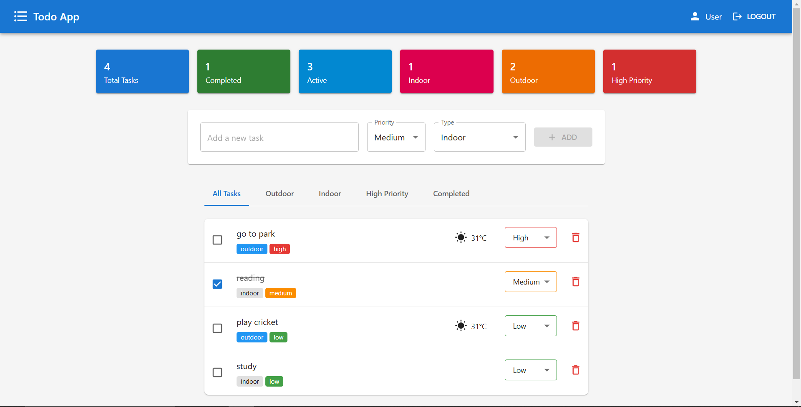
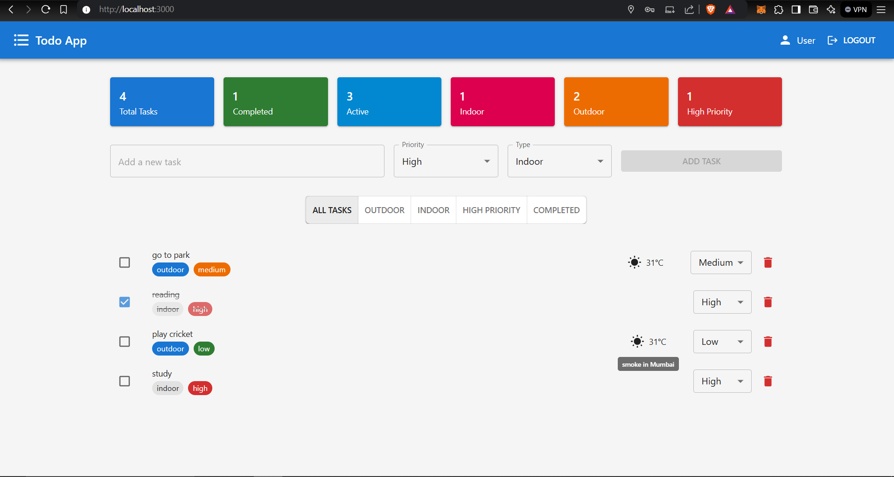
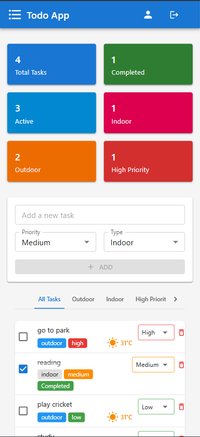
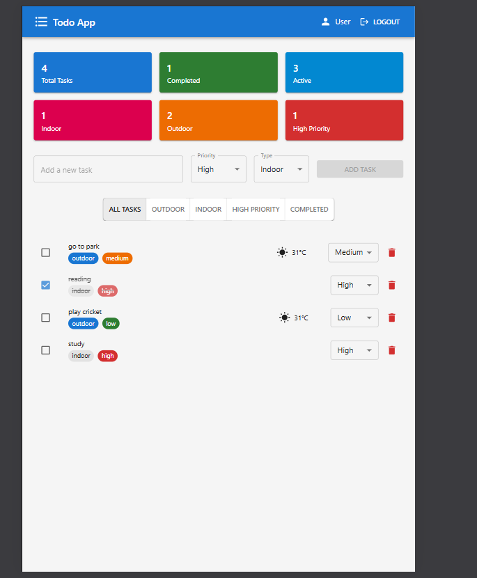

# Weather-Aware Todo App

A modern, responsive Todo application built with React that includes weather information for outdoor tasks. This project demonstrates the implementation of a full-featured task management system with user authentication, real-time weather updates, and a responsive design.



## Live Demo

[View Live Demo](https://your-deployment-url.netlify.app)

## Features

- **User Authentication**
  - Secure login and registration system
  - Persistent user sessions
  - Protected routes for authenticated users

- **Task Management**
  - Create, read, update, and delete tasks
  - Mark tasks as completed
  - Set task priority (Low, Medium, High)
  - Categorize tasks as Indoor or Outdoor
  - Real-time weather information for outdoor tasks
  - Filter tasks by type, priority, and completion status

- **Responsive Design**
  - Mobile-first approach
  - Seamless experience across all devices
  - Touch-friendly interface
  - Adaptive layout for different screen sizes

- **Weather Integration**
  - Real-time weather updates for outdoor tasks
  - Temperature display
  - Weather condition icons
  - Location-based weather information

## Technology Stack

- React 18
- Redux Toolkit for state management
- Material-UI (MUI) for UI components
- React Router for navigation
- OpenWeather API for weather data
- Firebase for authentication

## Setup Instructions

1. Clone the repository:
   ```bash
   git clone https://github.com/your-username/todo-app.git
   cd todo-app
   ```

2. Install dependencies:
   ```bash
   npm install
   ```

3. Create a `.env` file in the root directory with your API keys:
   ```env
   REACT_APP_WEATHER_API_KEY=your_openweather_api_key
   REACT_APP_FIREBASE_API_KEY=your_firebase_api_key
   REACT_APP_FIREBASE_AUTH_DOMAIN=your_firebase_auth_domain
   REACT_APP_FIREBASE_PROJECT_ID=your_firebase_project_id
   ```

4. Start the development server:
   ```bash
   npm start
   ```

The app will be available at `http://localhost:3000`

## Deployment

This app is configured for easy deployment to Netlify:

1. Create a new site on Netlify
2. Connect your GitHub repository
3. Configure build settings:
   - Build command: `npm run build`
   - Publish directory: `build`
4. Add your environment variables in Netlify's dashboard
5. Deploy!

## Project Structure

```
src/
├── components/
│   ├── Auth/
│   │   ├── Login.jsx
│   │   └── Register.jsx
│   └── Tasks/
│       ├── TaskInput.jsx
│       ├── TaskList.jsx
│       ├── TaskItem.jsx
│       └── TaskFilter.jsx
├── services/
│   └── weatherApi.js
├── store/
│   ├── authSlice.jsx
│   └── taskSlice.jsx
└── App.jsx
```

## Contributing

1. Fork the repository
2. Create a feature branch: `git checkout -b feature-name`
3. Commit your changes: `git commit -m 'Add feature'`
4. Push to the branch: `git push origin feature-name`
5. Submit a pull request

## License

This project is licensed under the MIT License - see the [LICENSE](LICENSE) file for details.

## Screenshots

### Desktop View


### Mobile View


### Task Management


## Future Improvements

- [ ] Add task due dates and reminders
- [ ] Implement task categories and tags
- [ ] Add task sharing functionality
- [ ] Integrate with calendar applications
- [ ] Add dark mode support
- [ ] Implement task statistics and analytics

## Contact

For any questions or feedback, please reach out to [yrmewara@gmail.com](mailto:yrmewara@gmail.com)
